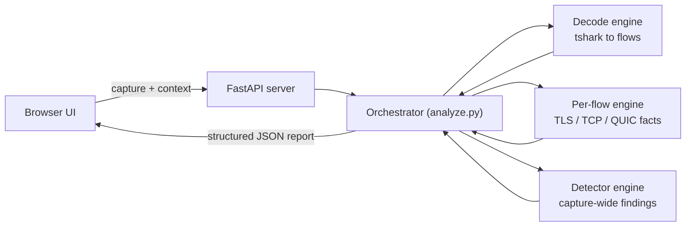

# TLS Inspector

A **local web app** that analyzes **Wireshark captures (PCAP/PCAPNG)** and/or **HAR logs** to
troubleshoot SSL/TLS decryption, SWG/NGFW/SASE inspection, certificate pinning, proxy issues,
QUIC/HTTP3 interference, and TCP/MTU problems — and produces a structured, evidence-based report.

It uses **tshark** (Wireshark CLI — the gold standard for TLS dissection) for packet analysis and
the **`cryptography`** library for precise X.509 certificate inspection (issuer/subject/SAN
comparison, corporate-CA detection). Everything runs 100% locally; nothing is uploaded anywhere.

## Architecture at a glance



Four cooperating engines turn a capture into a diagnosis. See
[docs/ARCHITECTURE.md](docs/ARCHITECTURE.md) for the full component guide,
detection techniques, the request sequence diagram and the intelligence-gathering
methodology.

## What it detects

- **TLS handshake analysis** — ClientHello/ServerHello, SNI, ALPN (h2/http1.1/h3), versions,
  cipher suites, session resumption, Encrypted Client Hello (ECH).
- **Certificate / interception** — proxy-injected corporate CA vs public CA, expired/not-yet-valid
  certs, SNI↔certificate name mismatch, full chain parsing.
- **TLS alerts** — handshake_failure, bad_certificate, unknown_ca, certificate_required,
  protocol_version, decrypt_error, internal_error, and more.
- **Certificate pinning (behavioral)** — TCP RST after ServerHello/Certificate, fails-only-when-
  decrypted patterns. Reported as a **signal, never asserted as proof**.
- **Proxy / SWG** — HTTP CONNECT/tunnel failures, 403/407/502/503/504, policy/category blocks.
- **QUIC / HTTP3** — UDP/443 detection and inspection-bypass warnings.
- **Network** — TCP retransmissions, zero windows, RSTs, MSS/MTU clues,
  receive-window-limited throughput, and detection of captures taken on the host
  before NIC segmentation offload (whose apparent reordering is an artifact).
- **Performance** — TLS HelloRetryRequest (an extra round trip, and any
  post-quantum key exchange the server refused), slow DNS/connect/TLS/TTFB.
- **HAR** — `ERR_CERT_AUTHORITY_INVALID`, `ERR_CERT_COMMON_NAME_INVALID`, `ERR_SSL_PROTOCOL_ERROR`,
  `net::ERR_FAILED`, tunnel failures, blocked requests, status codes, timings.
- **PCAP ↔ HAR correlation** — maps browser errors to the exact TCP/TLS flow.

## Requirements

- **Python 3.10+**
- **Wireshark / tshark** installed (Windows default `C:\Program Files\Wireshark\tshark.exe` is
  auto-detected; otherwise put `tshark` on PATH).

## Run

```powershell
cd "c:\DEV Copilot\TLS_Inspector"
./run.ps1
```

Then open <http://127.0.0.1:8000>, drop in a PCAP and/or HAR, add optional context (domain, IPs,
platform, policy, expected vs actual), and click **Analyze**. Download the full report as `.txt`.

### Manual run

```powershell
python -m venv .venv
.venv\Scripts\Activate.ps1
pip install -r requirements.txt
python -m uvicorn app.server:app --host 127.0.0.1 --port 8000
```

## Output format

The report follows a fixed structure: **Executive Summary → Technical Findings → Issue
Classification → Evidence → Recommendations**. It cites packet numbers, timestamps, SNIs, TLS
alerts and HAR errors — and clearly states when data is insufficient.

## Important limitations (by design)

- **HAR has no TLS bytes** — no ServerHello, certificates, ciphers or alerts. Deep TLS/cert analysis
  requires the PCAP.
- **TLS 1.3 encrypts the certificate** — it can't be read from PCAP without `SSLKEYLOGFILE` keys.
  SNI (unless ECH), ALPN, versions, alerts and TCP behavior are still analyzed.
- **Certificate pinning cannot be proven** from PCAP/HAR alone; it is inferred from behavior.
