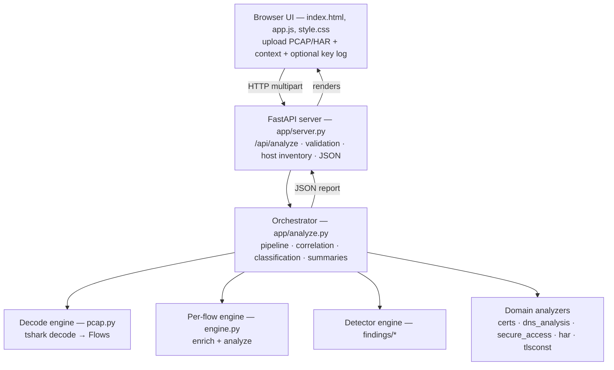
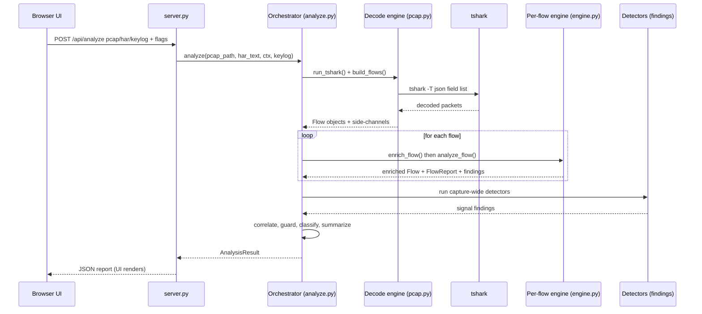
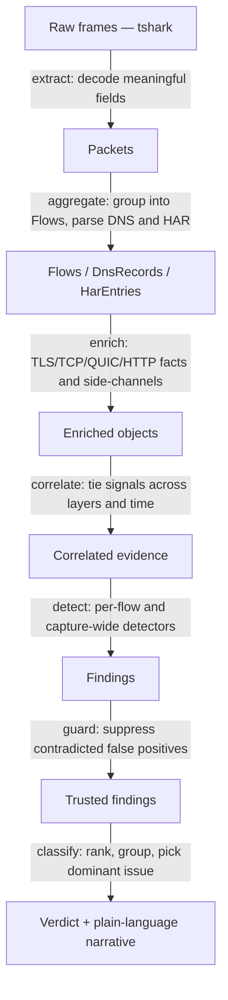

# Architecture

Capture Inspector turns a single packet/HAR capture into an evidence-based
network diagnosis. This document explains **what each part is**, **how the
analysis pipeline flows**, **which detection techniques it uses**, and **how raw
frames are turned into intelligence**. For the exact per-detector signals and
their limits see [DETECTION.md](DETECTION.md); for the capability assessment and
the technique catalog (T1-T29) see [ASSESSMENT.md](ASSESSMENT.md).

## 1. High-level layout

Capture Inspector is a local **FastAPI** service. The browser UI (static
HTML/CSS/JS) posts a capture to the API; the Python engine analyzes it and
returns a structured JSON report that the UI renders.

The engine ships as a standalone Windows executable (`Capture Inspector.exe`)
and via `run.ps1` / `Server Control.bat`. `tshark` (Wireshark) is the only
external runtime dependency for PCAP decoding.

## 2. Component guide - what each module does

Every module has one job. Grouped by role (line counts are approximate).

**HTTP & orchestration**

| Module | Responsibility |
|---|---|
| `app/server.py` | FastAPI layer. `POST /api/analyze` (multipart: pcap/har/keylog + mode flags) and `GET /api/health`. Builds the `AnalysisContext`, calls the orchestrator, serializes flows/findings/hosts/DNS/certs to JSON, and derives the **Host Inventory** (a per-peer asset view). |
| `app/analyze.py` | The **orchestrator**. Runs the pipeline stage by stage, performs cross-flow correlation, suppresses false positives, classifies findings into display groups, and writes both the technical verdict and the plain-language summary. Holds the `CLASSIFICATION_*` tables that give every category its label, rationale, analogy and remediation. |
| `app/context.py` | The `AnalysisContext` (operator inputs + mode flags) and `AnalysisResult` (the whole report) dataclasses. Kept in their own module to break an import cycle. |

**Capture decoding & assembly**

| Module | Responsibility |
|---|---|
| `app/pcap.py` | Everything tshark. Runs `tshark -T json` over an explicit field list, assembles bidirectional `Flow` objects per TCP/UDP stream, and mines PCAPNG side-channels (Name Resolution Blocks, `capinfos` provenance, the roaming module `STARTMSG` self-report). Owns the `Flow`/`Packet` types and the REDUCE filter for huge captures. |
| `app/engine.py` | Per-flow brain. `enrich_flow()` extracts TLS/TCP/QUIC/HTTP facts; `analyze_flow()` parses certificates and emits the per-flow findings (interception, pinning RST, QUIC/ECH, block pages, HTTP errors, tunnel status). |

**Domain analyzers**

| Module | Responsibility |
|---|---|
| `app/dns_analysis.py` | DNS parsing: rcode failures, block-page anycast-IP classification, public-resolver naming (so DoH/DoT is still recognized as DNS), and SWG-proxy region flapping. |
| `app/har.py` | HAR parsing and the `block.sse.cisco.com` block-page **JWT payload decode** (rule id, DLP file names) - request-level truth the encrypted PCAP cannot show. |
| `app/secure_access.py` | Cisco Secure Access IP intelligence: ingress/region lookup, CGNAT `100.64.0.0/10` ZTNA detection, and private/internal (RFC 1918 / ULA) classification. |
| `app/certs.py`, `app/certfetch.py` | X.509 leaf/chain parsing and optional live certificate fetch. |
| `app/tlsconst.py` | TLS constant maps (handshake types, alert descriptions, named groups, ECH extensions). |
| `app/report.py` | Renders the plain-text downloadable report from an `AnalysisResult`. |

**Detectors** - `app/findings/` (one module per domain; `__init__.py` re-exports them)

| Module | Detects |
|---|---|
| `base.py` | shared helpers (private/loopback IP tests, percentiles, clock formatting) |
| `dns.py` | DNS health + SWG-proxy region findings |
| `roaming.py` | roaming-module steering + `STARTMSG` report + ingress health |
| `network.py` | loss/retransmissions/RST/zero-window, ICMP PMTUD, MSS clamp / SA tunnel MTU, duplicate-capture, segmentation-offload |
| `access.py` | Private Access (ZTNA) + internal-traffic tagging |
| `latency.py` | slow DNS/connect/TLS/TTFB + geo-egress |
| `interception.py` | JA3S clustering + local loopback interception chain |
| `steering.py` | capture-derived per-destination inspection coverage (web/DNS/DoH/QUIC) |
| `quality.py` | network-quality verdict per destination (RTT / jitter / real loss) |
| `bottleneck.py` | idle-vs-active time-budget attribution |
| `proxy_pac.py` | PAC/WPAD discovery & fetch |
| `har_findings.py` | HAR failures, block-page grouping, `Via`/alt-svc/HTTP-1.1 proxy evidence |

**UI** - `app/static/` (`index.html`, `app.js`, `style.css`): drag-and-drop upload, the Summary and Technical cards, the Flows table with the connection-ladder sequence diagram, the Hosts inventory, and the DNS and Certs views. Static-only; changes need a browser reload plus a `?v=` cache-bump.

## 3. Engines - how they work

The analysis is driven by **four cooperating engines**. Each has a single
responsibility, a clear input and a clear output; the orchestrator sequences the
other three and then reasons over their combined output.

| Engine | Module | Input | Output | What it does |
|---|---|---|---|---|
| **Decode engine** | `pcap.py` | capture file (+ optional key log) | `Flow` objects + capture side-channels | Invokes tshark over a fixed field list, assembles bidirectional flows per TCP/UDP stream, mines PCAPNG side-channels, and (2nd pass) re-dissects the inner TLS inside CONNECT tunnels. Switches to REDUCE mode on captures over 80 MB. |
| **Per-flow engine** | `engine.py` | one `Flow` | enriched `Flow` + `FlowReport` + per-flow findings | `enrich_flow()` extracts every TLS/TCP/QUIC/HTTP fact; `analyze_flow()` parses the certificate, sets a human-readable `tls_status`, and emits the per-flow findings (interception, pinning, QUIC/ECH, block pages, tunnel status). |
| **Detector engine** | `findings/*` | the assembled `AnalysisResult` | capture-wide `signal_findings` | Cross-flow detectors that see the whole capture at once: JA3S clustering, local-interception chains, inspection coverage, latency, network health, MTU, asymmetric routing, roaming, DNS. |
| **Orchestration engine** | `analyze.py` | context + capture | the final `AnalysisResult` | Sequences the three engines above, then correlates, guards, classifies and summarizes (see sections 4 and 6). |

**Why split them this way.** Decoding is I/O-bound and tshark-specific; per-flow
analysis is local reasoning about one connection; detection needs the *whole*
capture to compare flows; and orchestration is where evidence from all three is
cross-checked. Keeping the boundaries clean is what lets a later stage question
an earlier one (for example, the detector engine can invalidate loss counters
the decode engine produced).

### How a request flows through the engines

## 4. End-to-end analysis pipeline

The single entry point is `analyze.analyze(pcap_path, har_text, ctx,
keylog_path)`. It runs the following stages.

### 4.1 PCAP branch

1. **Size gate / REDUCE mode** — captures larger than
   `_LARGE_CAPTURE_BYTES` (80 MB) are decoded with `pcap.REDUCE_FILTER`
   (handshake/control/DNS/ICMP/QUIC-init frames only). This keeps huge captures
   tractable; the trade-off is that bulk payload bytes are excluded from
   per-flow totals (`AnalysisResult.reduced = True`).
2. **Decode** — `pcap.run_tshark()` invokes `tshark -T json` over an explicit
   field list (`_FIELDS`) into a list of `Packet` objects. If a **TLS key log**
   is supplied it is passed to `tshark` so TLS 1.3 payloads (including inner
   CONNECT-tunnel TLS) can be decrypted.
3. **Flow assembly** — `pcap.build_flows()` groups packets into bidirectional
   `Flow` objects keyed by TCP/UDP stream. The **client** side is the SYN
   sender; for mid-stream captures a source-port heuristic disambiguates.
4. **PCAPNG side-channels** —
   - `extract_nrb_hosts()` reads Name Resolution Blocks (IP→hostname).
   - `extract_capture_env()` reads capture provenance (sniffer OS, capture app,
     hardware, interfaces) via `capinfos`.
   - `extract_roaming_report()` mines the Cisco Secure Client / Umbrella roaming
     module's clear-text loopback IPC self-report (`STARTMSG`): the SWG proxy +
     org it is bound to and its steered-vs-bypassed counters.
5. **DNS analysis** — `dns_analysis.analyze_dns()` builds per-name `DnsRecord`s:
   maps Secure Access block-page anycast IPs to their block category, names
   known public resolvers (so DoH/DoT on 443/853 is still recognized as DNS),
   flags rcode failures (NXDOMAIN/SERVFAIL/REFUSED) and unanswered queries, and
   tracks SWG-proxy-hostname region flapping. `_dns_findings()` turns those into
   findings.
6. **Flow enrichment** — `engine.enrich_flow()` extracts per-flow TLS facts
   (offered/negotiated version, SNI, cipher, groups, JA3/JA3S, handshake types,
   alerts, certificate bytes), TCP health (RST/FIN counts, retransmissions,
   lost/out-of-order segments, dup-ACKs, zero-window), QUIC detection, HTTP /
   CONNECT-proxy signals, directional byte/packet counts, **server TTL /
   SYN-ACK** (host fingerprinting inputs), MSS values, and timing markers
   (TCP-handshake RTT, TLS-setup time).
7. **DNS↔flow correlation** — `_correlate_dns_to_flows()` attaches the nearest
   preceding DNS lookup (≤1 s skew) to each flow so an IP-only flow gains its
   real hostname.
8. **PAC/WPAD findings** — `_pac_wpad_findings()`.
9. **Tunnel TLS 2nd pass** — `pcap.run_tunnel_tls()` + `merge_tunnel_tls()`
   re-dissect the payload **inside** explicit-proxy `CONNECT` tunnels to recover
   the inner TLS handshake (and, with a key log, the inner certificate).
10. **Context filter** — narrows to `target_flows` if the operator supplied a
    domain/src/dst filter.
11. **Per-flow analysis** — `engine.analyze_flow()` parses certificates, sets a
    human-readable `tls_status`, emits per-flow findings, and accumulates
    `corporate_ca_orgs` (issuers that look like an interception CA).
12. **Capture-wide detectors** (see [DETECTION.md](DETECTION.md)):
    - Always: JA3S clustering, local-interception chain, latency, duplicate-
      capture detection + dup-retransmission suppression, network health, ICMP
      PMTUD, MSS clamp / SA-tunnel MTU, asymmetric routing.
    - Secure-Access mode only: ingress-health, roaming, roaming-report,
      private-access (ZTNA CGNAT), internal-traffic suppression.

### 4.2 HAR branch

`har.parse_har()` → `_har_findings()` + `_har_proxy_findings()` +
`_latency_findings_har()`. HAR gives request-level truth (status codes, proxy
errors, timing) that the encrypted PCAP cannot.

### 4.3 Correlation, guarding, summarizing

1. `_correlate()` — maps HAR failures to PCAP flows by host/SNI/IP and ties
   proxied-OK HAR entries to CONNECT tunnels by host + time window.
2. `_correlate_web_blocks()` — names the destination behind an opaque
   `block.sse.cisco.com` page by matching the real domain requested ≤8 s before.
3. `_suppress_pinning_on_trusted_hosts()` — drops the pinning signal for any
   host that also completed a graceful connection elsewhere (real pinning
   rejects **every** connection).
4. `_classify()` — buckets findings into display labels and builds the
   severity-ranked `tech_groups`.
5. `_summarize()` + `_plain_summary()` — pick the dominant issue and produce the
   technical verdict **and** the plain-language executive narrative
   (summary / impact / recommended action / scope / secondary notes).

## 5. Detection techniques

The engine deliberately favours **provable signals over guesses**. Every detector
falls into one of the technique classes below; the exact per-detector signal and
its RFC/source live in [DETECTION.md](DETECTION.md) and the T1-T29 catalog in
[ASSESSMENT.md](ASSESSMENT.md).

| Technique class | How it works | Example detectors |
|---|---|---|
| **Exact protocol-constant match** | Compare a field against a value fixed by an RFC - no inference | HelloRetryRequest (RFC 8446 fixed ServerHello Random), block-page anycast-IP ranges |
| **Certificate / PKI parsing** | Parse the X.509 leaf/chain and reason about issuer, validity and names | re-signed proxy CA, expired / name-mismatch, Secure Access Root CA positive match |
| **TLS fingerprinting** | Hash handshake features (JA3/JA3S) and cluster them | one JA3S fronting >=5 destinations = a single decrypting terminator |
| **Both-ends reasoning** | Exploit that both ends of a loopback flow are the same machine | local endpoint-agent interception (the novel core) |
| **Impossibility argument** | A signal that cannot exist unless a specific condition holds | a segment larger than the negotiated MSS => the capture was taken above the NIC (offload) |
| **Behavioral inference** | Read intent from packet behaviour, never asserted as proof | certificate pinning (RST after ServerHello with no graceful close) |
| **Aggregate / statistical** | Judge on rates and per-destination sets, not raw counts | inspection coverage, loss as a % of data segments, DNS region flapping |
| **Time-window correlation** | Link events the wire does not link, always labelled as correlation | block page -> real domain (<=8 s), loopback leg -> outbound leg (<=10 s), DNS -> flow |
| **Vendor-signal decoding** | Decode a documented or empirically-derived vendor artifact | roaming `STARTMSG` IPC blob, `block.sse` block-info JWT |

## 6. Intelligence-gathering methodology

Raw frames become a verdict through a **narrowing funnel** - each stage adds
meaning and discards noise. This is the "how the intelligence is built" view.

**The principles that make the intelligence trustworthy**

1. **Layered extraction, not a flat parse.** Meaning is added in stages, so a
   later stage can question an earlier one - a duplicate-capture finding, for
   example, invalidates the loss counters computed upstream.
2. **Correlation over isolated events.** A single packet rarely means anything;
   the value is in tying a DNS answer, a TLS flow, a block page and a HAR error
   into one story. Cross-layer links are always labelled as correlation, never
   as cryptographic proof.
3. **Cross-checking a claim against the same capture.** Loss is withheld on
   captures whose counters are known unreliable (duplicated interfaces,
   host-side offload) so the report can never contradict itself.
4. **Rates, never raw counts; per-destination, never per-connection.** A long
   capture accumulates events without being unhealthy, and a host inspected on
   one connection is not "bypassed" because another went direct.
5. **False-positive guards are first-class.** Dedicated `_suppress_*` steps
   exist only to remove a signal that a second piece of evidence contradicts.
6. **Honesty layer.** Confidence is capped where a signal is inference (pinning
   <= Medium), misleading percentages are withheld, and every detector states
   what it *cannot* see. Vendor naming is off by default (agnostic mode) and
   only enabled in Secure Access mode.
7. **Evidence-cited output.** Findings carry packet numbers, timestamps, SNIs,
   JA3S, alerts and flow keys, so every conclusion can be audited back to the
   capture.

## 7. Data model

Defined across `engine.py`, `certs.py`, `dns_analysis.py`, `har.py` and
`context.py`.

| Type | Where | Role |
|---|---|---|
| `AnalysisContext` | context.py | Operator inputs + mode flags (`secure_access_mode`, `sa_tunnel`, optional domain/src/dst filter). |
| `Packet` | pcap.py | One decoded frame; `.first(key)` / `.all(key)` access tshark fields. |
| `Flow` | pcap.py | A bidirectional connection with all enriched TLS/TCP/QUIC/HTTP facts, directional counters, TTL/SYN-ACK, tunnel fields and interception-chain cross-links. |
| `FlowReport` | engine.py | Per-flow result: parsed leaf/chain certs, `tls_status`, `block_category`, `findings`. |
| `Finding` | engine.py | One diagnostic: `title`, `severity` (critical/high/medium/low/info), `category`, `detail`, `evidence[]`, `flow_key`. |
| `CertInfo` | certs.py | Parsed X.509 leaf/chain + heuristic flags (`looks_like_proxy_ca`, `looks_like_public_ca`, `is_secure_access`, `is_secure_access_root`, expiry, self-signed). |
| `DnsRecord` | dns_analysis.py | Per-name DNS result: addresses, rcode, resolver, `blocked`, `block_category`, region-flap `proxy_responses`. |
| `HarResult` / `HarEntry` | har.py | Parsed browser log entries and failures. |
| `AnalysisResult` | context.py | The whole report: flow reports, DNS records, all finding buckets, correlations, `classifications`, `tech_groups`, `corporate_ca_orgs`, capture env, roaming report, `reduced` flag, and every plain-language field. |

## 8. Operating modes

- **Agnostic (default)** — no vendor naming. Detects interception, certs,
  pinning, proxy blocks, DNS, network, latency, QUIC generically.
- **Cisco Secure Access mode** (`secure_access_mode=True`) — additionally
  enables the SA CA/PKI positive match, published ingress/egress IP ranges,
  Private Access (ZTNA CGNAT 100.64.0.0/10) awareness, SWG steering coverage,
  the roaming-module report, and (with `sa_tunnel`) the SA tunnel-MTU alert
  (expected MTU 1390 / MSS 1350).

## 9. Build & runtime notes

- Static assets are versioned via `?v=NNNN` on `style.css` and `app.js` in
  `index.html`. Bump on any static change.
- Python changes to the engine require a server restart (and the in-process
  regression harness `_refactor_regress.py check` must still print
  "IDENTICAL — no regressions").
